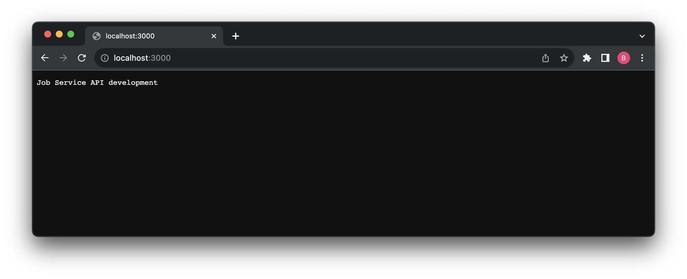
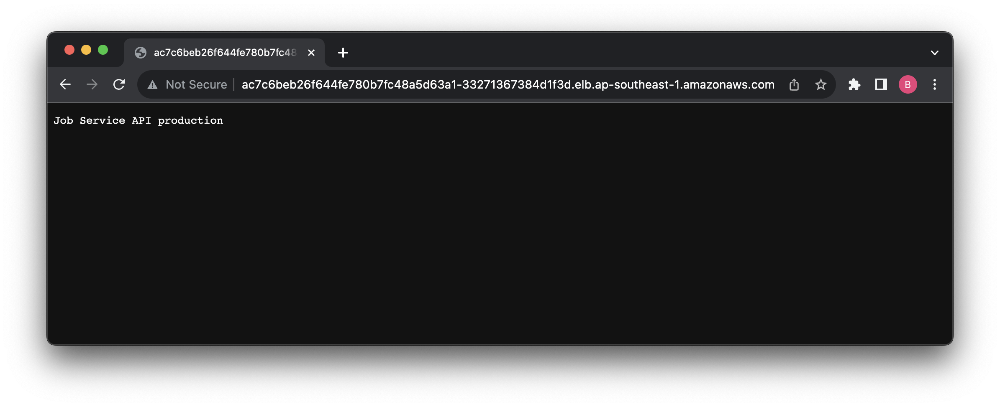
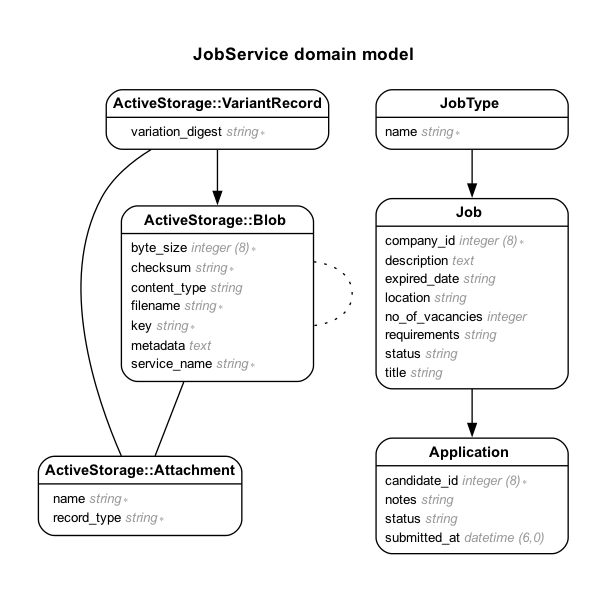

# Job Service

[Development](http://localhost:3000/)

```shell
docker compose up
```



[Production](ac7c6beb26f644fe780b7fc48a5d63a1-33271367384d1f3d.elb.ap-southeast-1.amazonaws.com)



Entity Relationship Diagram



**Documenting APIs with Swagger**

https://github.com/rswag/rswag

https://betterprogramming.pub/documenting-ruby-on-rails-apis-using-rswag-gem-48c92e11ea30

```shell
  docker compose build
  docker compose run web rake rswag:specs:swaggerize
  docker compose up
```

http://127.0.0.1:3000/api-docs/index.html


**Integrate with Kibana UI for log management**

https://medium.com/@AnjLab/how-to-set-up-elk-for-rails-log-management-using-docker-and-docker-compose-a6edc290669f

https://medium.com/@nam-nguyen/configuring-docker-elasticsearch-kibana-logstash-to-get-log-rails-98a260350a91
